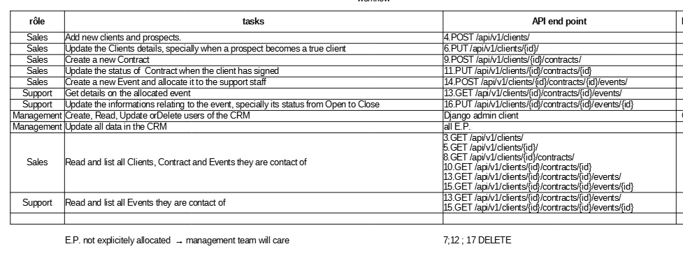

  


# ocr-p12 Développez une architecture back-end sécurisée en utilisant Django ORM

- Table of Content
  - [Disclaimer](#disclaimer)
  - [Quick Start](#quick-start)
  - [Security and Privacy](#security-and-privacy)
  - [Epic Events API documentation](#Epic-Events-API-documentation)
  - [Tests passed](#tests-passed)
  - [Crédits and good reads](#credits-and-good-reads)
  - [PEP 8 check](#pep-8-check)


  
## Disclaimer

---

This code is part of the openclassrooms learning adventure split in 13 business alike projects.  
  
  
Some materials or links may have rights to be granted by https://openclassrooms.com. 
The additionnal code follows "CC BY-SA ".
  
** Not to be used for production **  

---

## Epic Events API documentation

### Introduction

Epic Events does host the funniest and greatest parties in this quarter of the Universe. We manage the full event to ease all the tedious preparation work for our Very Important Clients!

Our I.T department has just improved and secured our internal CRM to support our Customer's and our own business.
For our partners to develop mobile front-end applications as well as for our own staff, we release our API Rest server.

You will find here guidance and a brief introduction on how to install and use our secured API server.

**Have fun, Dev!**


## Quick start


In order to install and use locally the Epic Events CRM back-end API server, assuming you have Python 3 instyalled, open bash prompt: 

1.  clone the ocr-p12 directory into your local copy.
    `git clone https://github.com/dev-KC20/ocr-p12.git  
  
2.  move to the working directory   
    `cd ocr-p12  
  
3. create a python virtual environment named ENV  
    `python -m venv ENV  
  
4.  do not forget to active the ENV virtual environment  
    `ENV\scripts\activate.bat  

5.  install all the requirments,  
    `pip install -r requirements-dev.txt 

6.  move into the source directory,
    `cd eecrm     
  
7.  create a .env file in order to keep all secrets local and safe (see hereunder for details),  
     ``` 
        SECRET_KEY = *"yourverystrongandsecurekey"*
        DEBUG = True
        # db postgreSQL
        PG_NAME = eecrm
        PG_USER = admin-oc
        PG_PASSWORD = *"yourverystrongandsecurepassword"*
        PG_HOST = localhost
        ADMIN_ID = admin-oc
        ADMIN_PASSWORD = *"yourverystrongandsecurepassword"*
        #PYTHONPATH = *"yourlocalpathtopython"*
        ALLOWED_HOSTS=localhost, 127.0.0.1 
        #.herokuapp.com
     ``` 
  
8.  download PostgreSQL database from [PostgreSQL: Downloads](https://www.postgresql.org/download/) and follow their instructions.  
9. 
    You will have to provide an account and password for PostgreSQL root user.  
    Our team uses psql in version 14 and also installed the full SQL admin studio 'pgAdmin 4'  
  
10. open the psql shell provided with at step 8. and connect to the database  
```  
            psql  
            Server [localhost]:  
            Database [postgres]:  
            Port [5432]:  
            Username [postgres]: PostgreSQL root user  
            Mot de passe pour l'utilisateur PostgreSQL root user :  
```  
11. create a dedicated database for the Epic Events CRM,  
```sh  
            CREATE DATABASE eecrm  
                WITH  
                OWNER = "PostgreSQL root user"  
                ENCODING = 'UTF8'  
                LC_COLLATE = 'French_France.1252'  
                LC_CTYPE = 'French_France.1252'  
                TABLESPACE = pg_default  
                CONNECTION LIMIT = -1;  
  
            ALTER ROLE "PostgreSQL root user" SET default_transaction_isolation TO "read committed";  
            ALTER ROLE "PostgreSQL root user"  SET timezone TO "UTC";  
            GRANT ALL PRIVILEGES ON DATABASE "eecrm" TO "PostgreSQL root user";  
            ALTER USER "PostgreSQL root user" CREATEDB;  
```  
     
      
12. back to the python prompt, build and run Django models migration    
    `python manage.py makemigrations   
    `python manage.py migrate  
    
13. create a Django superuser  
    `python manage.py createsuperuser  
    Username: ADMIN_ID  
    Email address: adminoc@mail.fr  
    Password: ADMIN_PASSWORD  
    Password (again):  

14. Eventually run the server  
    `python manage.py runserver   
   
  
## Security and privacy  
    
    Epic Events and its co-workers do take your privacy and your data safety very seriously. Out IT team has set several security measures to ensure nothing bad may happen to your data.  
    Epic Events publishes a developper technical guide which requires to protect our solutions against top 10 "owasp" security threats (see also the "credits and good reads" section).  
  
    First of all, we introduced the segregation of duties in how our staff is interacting with your data. Only the manager level has full access whereas salesmen only work on prospection and contract and the support team only care about the events we organize.  
  
  
    |dep./object  |	User      |  Customer | Contract |	Event    |  
    |-------------|-----------|-----------|----------|-----------|  
    |anonymous    |	forbidden |	forbidden | forbidden|	forbidden|  
    |sales_team   |		      |  [CR]UDL  |    RL    |  RL       |  
    |sales_contact|		      |   inherit |own [CR]UD|	own [CR] |  
    |support_team |		      |    RL	  |    RL	 |    RL     |  
    |supp_contact |			  |     	  |          |   own UD  |  
    |managmnt_team|	  CRUDL   |	  CRUDL	  |  CRUDL	 |  CRUDL    |  
    |is_staff     |	          |	    RL	  |    RL	 |    RL     |  
  
    For instance, creating user or clients cannot be done thru our exposed back-end API server but need to use a dedicated Admin front-end whose access is strongly restricted.  
      
    On the exposed back-end API server side, we ensure that front-end clients don't temper with the url or the json request body they send to the server.  
  
    All technical operations are logged and help us to prevent and identify any mis-behavior or attacks

    Finally the code itself is secured by reducing the exposure of secrets to public repositories,   


### Gestion des secrets  

Django utilise un "secret" pour générer ses certificats et recommande de garder cette clé secrète. 
Nous utilisons le paquet python-decouple pour remplacer les clés de secret par leur valeur dans le fichier settings.py :
Le fait de stocker les secrets dans un fichier .env évite de le "committer" par accident sur un dépôt centralisé grâce au paramétrage de notre .gitignore.

S'agissant ici d'un exercice pédagogique, nous voulons permettre d'utiliser notre code source et éventuelles données tout en respectant les bonnes pratiques. C'est pourquoi nous autorisons exceptionnellement le commit du fichier .env.

```py
from decouple import config
...
SECRET_KEY = config("SECRET_KEY")

```  

## Epic Events API documentation

  

Postman documentation

## Tests passed  


### Django ApiTestCase pass 9/9

  

  


## Credits and good reads.

Openclassrooms and even more the DA Python discord gals & guys!

Offical [Django](https://docs.djangoproject.com/fr/4.0/topics/security/#sql-injection-protection), [DRF(https://www.django-rest-framework.org/)] et [pytest](https://docs.pytest.org/en/7.1.x/) documentation!  
  
On owasp and Django, 
[Django vs. the OWASP Top 10 - Part 1](https://blog.nvisium.com/django-vs-the-owasp-top-10-part-1)  
  
Nicely written and opiniated post on [PyTest with Django REST Framework: From Zero to Hero - DEV Community](https://dev.to/sherlockcodes/pytest-with-django-rest-framework-from-zero-to-hero-8c4) 
kudos @LucasMiguel aka https://dev.to/sherlockcodes  
  
For his clear review of django's permissions, thx @Oluwole Majiyagbe
[Permissions in Django | TestDriven.io](https://testdriven.io/blog/django-permissions/)   

Again and on the previous topic, thank you  @ŠpelaGiacomelli (aka GirlLovesToCode) for your post series, [Custom Permission Classes in Django REST Framework | TestDriven.io](https://testdriven.io/blog/custom-permission-classes-drf/)  

One more on permissions which saved me hours is @marcuslind90 with
[How to restrict access with Django Permissions · Coderbook](https://coderbook.com/@marcus/how-to-restrict-access-with-django-permissions/)   
  
  
it has been my battle to find out how to test with a PostgreSQL database thx here @George Leslie-Waksman for
[Better PostgreSQL testing with Python: announcing pytest-pgsql and pgmock | by George Leslie-Waksman | Clover Health](https://technology.cloverhealth.com/better-postgresql-testing-with-python-announcing-pytest-pgsql-and-pgmock-d0c569d0602a)  
  
on Logging, thx @ Malik Albeik for [Monitoring user actions with LogEntry in Django Admin | Malik Albeik](https://malikalbeik.com/blog/monitoring-user-actions-with-logentry-in-django-ad)  
  
The REal Python not only runs a great podcast but also teaches well, here a review on Django Admin [What You Need to Know to Manage Users in Django Admin – Real Python](https://realpython.com/manage-users-in-django-admin/)  


## PEP 8 check

`flake8 --format=html --htmldir=flake8_report

  
